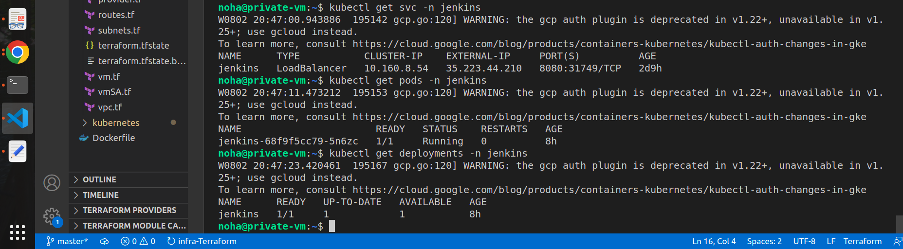

# ITIFinal

[http://34.121.163.8:3000/](http://34.121.163.8:3000/)  (application URL)

[http://35.223.44.210:8080/](http://35.223.44.210:8080/)  (jenkins URL) 

# 1-Creating Infrastructure

### I have created Infrastructure using terraform and Google Cloud Provider:

 1-vpc with two subnets public and private 

2- VM attached to the public subnet.

3-firewall to be applied on the VPC to allow ssh  on vm.

4-GKE cluster with size (e2-medium ⇒ to allow deployment on the cluster pod )

## 2-Deploying Jenkins

### SSH on my  VM and then connecting to the cluster

```bash
gcloud compute ssh --zone "us-central1-a" "private-vm"  --project "my-project-noha”
```

### 

## Configuring and installing kubectl inside VM using gcloud

```
noha@noha:~/Desktop/GCP-TASK$ gcloud compute ssh --zone "us-central1-a" "private-vm"  --tunnel-through-iap --project "my-project-noha"
noha@private-vm:~$ export CLOUD_SDK_REPO="cloud-sdk-$(lsb_release -c -s)"
noha@private-vm:~$ curl -O <https://dl.google.com/dl/cloudsdk/channels/rapid/downloads/google-cloud-cli-394.0.0-linux-x86_64.tar.gz>
noha@private-vm:~$ tar -xf google-cloud-cli-394.0.0-linux-x86_64.tar.gz
noha@private-vm:~$ ./google-cloud-sdk/bin/gcloud init
noha@private-vm:~$ gcloud components update
noha@private-vm:~$ echo "deb [signed-by=/usr/share/keyrings/cloud.google.gpg] <https://packages.cloud.google.com/apt> cloud-sdk main" | sudo tee -a /etc/apt/sources.list.d/google-cloud-sdk.list
noha@private-vm:~$ curl <https://packages.cloud.google.com/apt/doc/apt-key.gpg> | sudo apt-key --keyring /usr/share/keyrings/cloud.google.gpg add -
noha@private-vm:~$ sudo apt-get update
noha@private-vm:~$ sudo apt-get install google-cloud-sdk-gke-gcloud-auth-plugin
noha@private-vm:~$ sudo apt-get install kubectl

```

# Building a docker image to be used in the deployment  with jenkins dockerhub as a base image and other softwara resources (kubectl, docker, gcloud).


# Inside my VM I have just connected to the cluster and created :

### 1- a namespace -jenkins-

### 1-Deployment of Jenkins image .

### 2-Load balancer Service to access jenkins URL.

### 3-Mount volume to persist data  of the pod on the cloud.


